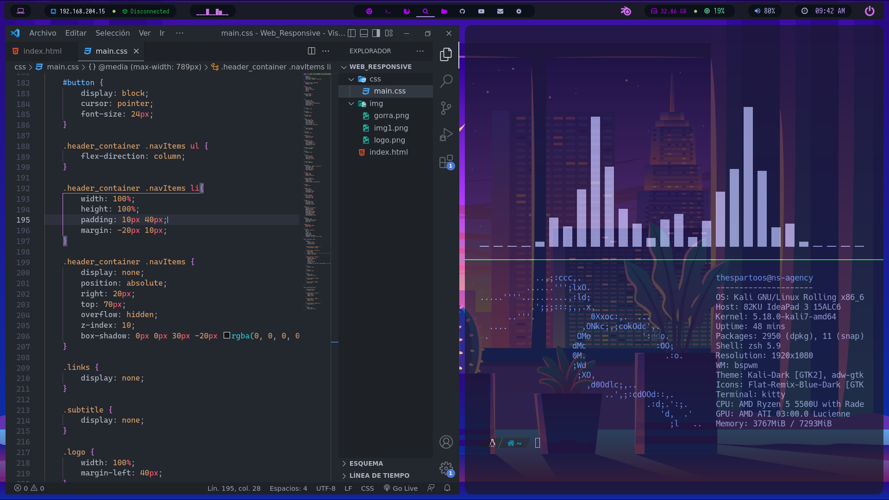
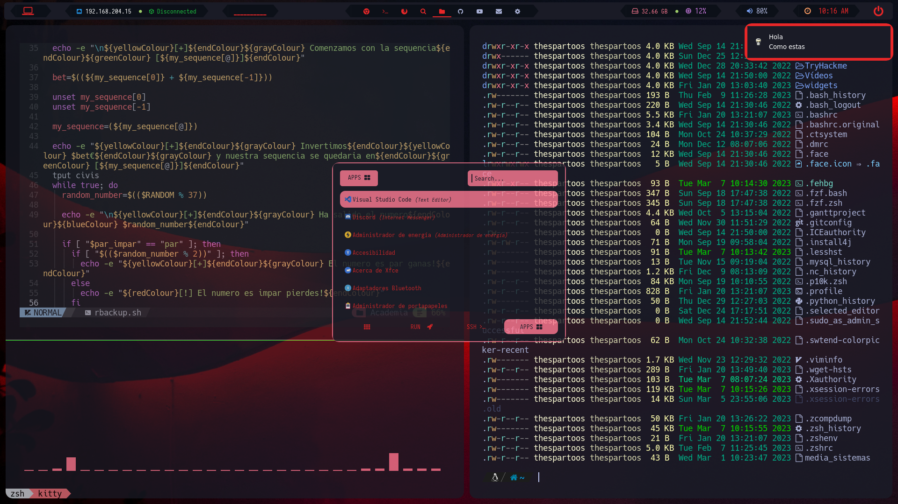
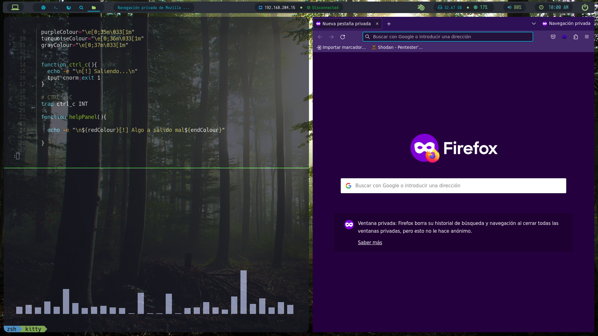
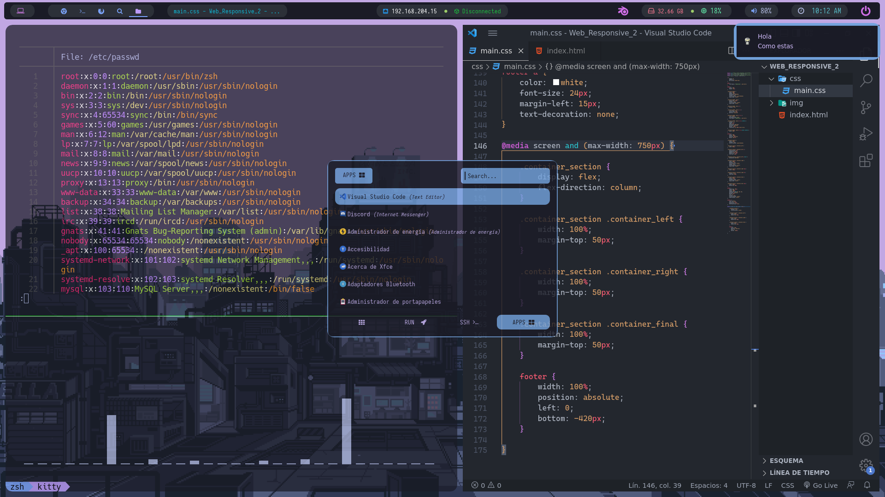

<h1 align="center"> Hack Debian OS Dotfiles 🔥 </h1> 

<!-- shields -->

</br>

Credits dotfiles: [**`mmsaeed509`**](https://github.com/mmsaeed509/)

<br>

<h1 align="left"> :computer: about</h1>



</br>

 - OS: [**`Kali Linux`**](https://www.kali.org/)
 - WM: [**`bspwm`**](https://github.com/baskerville/bspwm) 
 - Bar: [**`Polybar`**](https://github.com/polybar/polybar)
 - Compositor: [**`picom`**](https://github.com/yshui/picom)
 - terminal: [**`kitty`**](https://github.com/kovidgoyal/kitty)
 - Aapp Launcher: [**`rofi`**](https://github.com/davatorium/rofi)
 - Shell: [**`zsh`**](https://ohmyz.sh)

</br>


<!-- About -->

<br><br>
<h1 align="center"> WM </h1>
<center>

|BSPWM|
|--|
|  |

</center>


### [Table of content](#table-of-content)
+ **Dependencies**
  - [**`What AutoBspwm will install`**](#dependencies)
+ **Installation**
  - [**`How To Install dotfiles`**](#installation)

<!-- Dependencies -->

### Dependencies

- **WM** : [**`bspwm`**](https://madnight.github.io/bspwm/) [**`rofi`**](https://archlinux.org/packages/?name=wmname) [**`sxhkd`**](https://wiki.archlinux.org/title/Sxhkd) [**`dunst`**](https://wiki.archlinux.org/title/Dunst)  [**`ranger`**](https://github.com/hanschen/ksuperkey) [**`xclip`**](https://wiki.archlinux.org/title/clipboard) [**`fzf-lovely`**](https://i3wm.org/)

- **Utilities** : [**`rofi`**](https://github.com/davatorium/rofi) [**`polybar`**](https://github.com/polybar/polybar) [**`xorg-xsetroot`**](https://archlinux.org/packages/extra/x86_64/xorg-xsetroot/) [**`xsettingsd`**](https://wiki.archlinux.org/title/Xsettingsd) [**`xfce4-power-manager`**](https://wiki.archlinux.org/title/Power_management) [**`xfce-polkit`**](https://wiki.archlinux.org/title/Polkit) [**`eww`**](https://github.com/elkowar/eww)

- **Terminal Apps** : [**`kitty`**](https://alacritty.org/) [**`nvim`**](https://neovim.io/) [**`zsh`**](https://wiki.archlinux.org/title/zsh) [**`powerlevel10k`**](https://github.com/romkatv/powerlevel10k) [**`sudo plugin`**](https://code.visualstudio.com/) [**`bat`**](https://code.visualstudio.com/) [**`lsd`**](https://code.visualstudio.com/)

- **Media** : [**`feh`**](https://wiki.archlinux.org/title/feh) [**`thunar`**](https://wiki.archlinux.org/title/thunar) [**`Nerd Fonts`**](https://github.com/ryanoasis/nerd-fonts)

- **Text Editor** : [**`Visual Studio Code`**](https://code.visualstudio.com/) [**`Google Chrome`**](https://code.visualstudio.com/) [**`Firefox`**](https://code.visualstudio.com/)

- **Themes** : [**`Backgrounds`**](https://github.com/Exodia-OS/exodia-backgrounds) [**`themes`**](https://github.com/Exodia-OS/exodia-themes) 

<!-- Installation -->

### Installation

~~~bash

git clone https://github.com/thespartoos/AutoBspwm

cd AutoBspwm

chmod +x autoBspwm.sh

# run Autobspwm script

./autoBspwm.sh

# select theme

./autoBspwm.sh -t forest

# change them

./autoBspwm.sh -c deep


~~~
<br>
:warning: Once you have run the script you have to select BSPWM in the user selection menu. in case the screen does not fit the dimensions you have to run the following command
<br><br>

```bash
xrandr -s <1920x1080 or your-dimensions>
```
<br><br>

<!-- Available Themes Previews -->

<h2 align="center">Available Themes Previews</h2>

<center>

|Deep|Red|
|--|--|
|  |  |

|Forest|Tokyo|
|--|--|
|  |  |

</center>

<h2 align="center">sxhkd commands</h2>

```bash
# ------------------------------------------------------------------------------------------------
#
# wm independent hotkeys
#
 
# terminal emulator
super + Return
    kitty
 
# program launcher
super + d
    rofi -show drun -theme ~/.config/rofi/themes/launcher.rasi
 
# make sxhkd reload its configuration files:
super + Escape
    pkill -USR1 -x sxhkd
 
#
# bspwm hotkeys
#
 
# quit/restart bspwm
super + alt + {q,r}
    bspc {quit,wm -r}
 
# close and kill
super + {_,shift + }w
    bspc node -{c,k}
 
# alternate between the tiled and monocle layout
super + m
    bspc desktop -l next
 
# send the newest marked node to the newest preselected node
super + y
    bspc node newest.marked.local -n newest.!automatic.local
 
# swap the current node and the biggest node
super + g
    bspc node -s biggest
 
#
# state/flags
#
 
# set the window state
super + {t,shift + t,s,f}
    bspc node -t {tiled,pseudo_tiled,floating,fullscreen}
 
# set the node flags
super + ctrl + {m,x,y,z}
    bspc node -g {marked,locked,sticky,private}
 
#
# focus/swap
#
 
super + {_,shift + }{Left,Down,Up,Right}
       bspc node -{f,s} {west,south,north,east}
 
 
# focus the node for the given path jump
super + {p,b,comma,period}
    bspc node -f @{parent,brother,first,second}
 
# focus the next/previous node in the current desktop
super + {_,shift + }c
    bspc node -f {next,prev}.local
 
# focus the next/previous desktop in the current monitor
super + bracket{left,right}
    bspc desktop -f {prev,next}.local
 
# focus the last node/desktop
super + {grave,Tab}
    bspc {node,desktop} -f last
 
# focus the older or newer node in the focus history
super + {o,i}
    bspc wm -h off; \
    bspc node {older,newer} -f; \
    bspc wm -h on
 
# focus or send to the given desktop
super + {_,shift + }{1-9,0}
    bspc {desktop -f,node -d} '^{1-9,10}'
 
#
# preselect
#
 
# preselect the direction
super + ctrl + alt + {Left,Down,Up,Right}
    bspc node -p {west,south,north,east}
 
 
# preselect the ratio
super + ctrl + {1-9}
    bspc node -o 0.{1-9}
 
# cancel the preselection for the focused node
super + ctrl + space
    bspc node -p cancel
 
# cancel the preselection for the focused desktop
super + ctrl + alt + space
    bspc query -N -d | xargs -I id -n 1 bspc node id -p cancel
 
#
# move/resize
#
 
# expand a window by moving one of its side outward
#super + alt + {h,j,k,l}
#   bspc node -z {left -20 0,bottom 0 20,top 0 -20,right 20 0}
 
# contract a window by moving one of its side inward
#super + alt + shift + {h,j,k,l}
#   bspc node -z {right -20 0,top 0 20,bottom 0 -20,left 20 0}
 
# move a floating window
super + ctrl + {Left,Down,Up,Right}
    bspc node -v {-20 0,0 20,0 -20,20 0}
 
# Custom move/resize
alt + super + {Left,Down,Up,Right}
    /home/thespartoos/.config/bspwm/scripts/bspwm_resize {west,south,north,east}


# firefox

super + shift + f
    /opt/firefox/firefox

# GOOGLE CHROME

super + shift + g
    google-chrome

```

